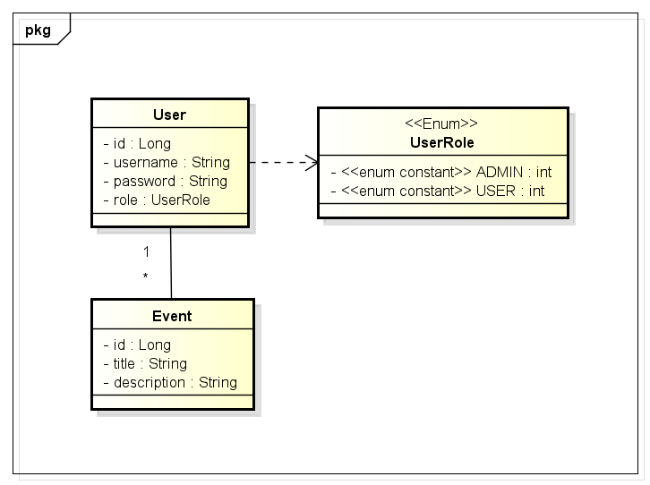

# events-api

### Como rodar:

Tendo instalado o JDK 17+, na pasta raiz do projeto use o comando:

    ./mvnw spring-book:run

### Dependências

- H2: Banco de dados em memória
- Lombok: anotações para getters/setters, construtores..
- JPA: ORM
- DevTools: Refresh automático e utilidades para desenvolvimento

### Class diagram

